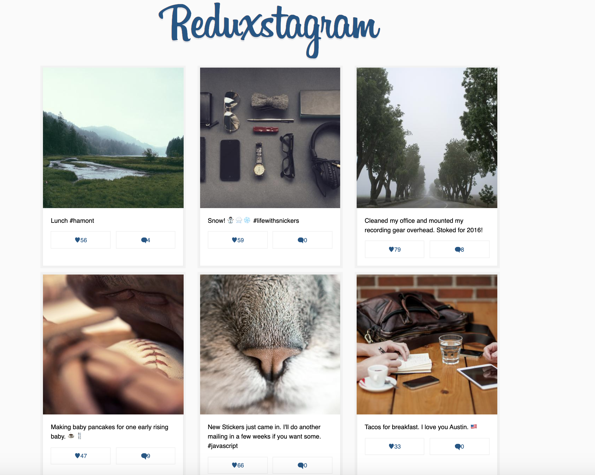
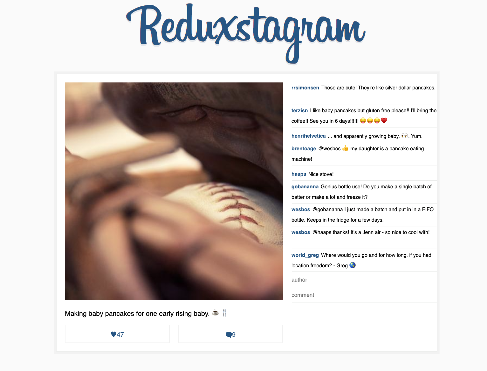

# Learn Redux

A simple React + Redux implementation. This will be turned into a free video series once the app is totally fleshed out.

It implements the following, a grid of posts and a single page view with comments

Performs like and and/remove comments actions.

## Running

First `npm install` to grab all the necessary dependencies. 

Then run `npm start` and open <localhost:7770> in your browser.

## Production Build

Run `npm build` to create a distro folder and a bundle.js file.
